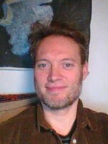

<h1>1.del. : Introduktion til faget - d.8/8-25</h1>

  
Undervisere

<h5>Anders Juul Refslund Petersen, eksamens- og undervisnings-ansvarlig</h5>

<h5>Mohammed Saleh, pædagogikums-kandidat og gæste-underviser</h5>

 

  
Undervisningsform

    <ul>
        <li><b>Logbog:</b> vi skal anvende "logbog",- nedskrive erfaringer og gemme arbejde, et sted hvor underviserne kan følge med. Vi starter med at anvende p5js editoren, og bare skrive kommentarer i jeres filer</li> 
        <li><b>Test:</b>,- vi laver løbende test uden hjælpemidler</li>
        <li><b>Afleveringer:</b>, kode og/eller video hvor i forklarer koden</li>
        <li><b>Fagord:</b>,- det er vigtigt at i anvender rigtige fagtermer</li>
        <li><b>Diagrammer:</b>,- ord er ikke altid nok, i skal også lære at illusterer og formidle jeres programmer igennem forskellige diagram-typer</li> 
        <li><b>Karaktergivning:</b>,- gives hovedsagligt på baggrund af test og afleveringer</li>
        <li><b>Eksperimentel undrevisning:</b>,- der kan forkomme forskellig varierende undrervisningsformer som Mohammed vil afprøve på jer ;-) </li>
    </ul> 
 

  
Dygtige elever

    <ul>
    <li>Meget dygtige elever og elever der allerede kan programmere</li>
    <li>Husk dette er et grundkursus i programmering!</li>
    <li>husk de andre skal lære det du allerede kan!</li>
    <li>Du kan måske bede om eller foreslå mere avancerede opgaver til dig?</li>
    <li>Og hjælpe meget gerne de andre når du er færdig?</li>
    </ul>

  
Planlagt pensum ( kan ændres lidt )

    <ul>
    <li>Basisstof via p5.js: variable, typesystem, forgreninger, løkker, array, intro til object samt funktioner i js</li>
    <li>flowchart og pseudokode</li>
    <li>OOP: Intro til objektorienteret prog (class & object) + om JSON som dataformat</li>
    <li>OOP: fortsat, om arv & polymorfi samt om klassediagrammer til at repræsentere programmet</li>
    <li>Om funktioner i js: mere avanceret om funktioner/metoder i js</li>
    <li>Om html, css & js: den basale tech‐stak til webprogrammering</li>
    <li>Algoritmer – rekursion, intro til tidskompleksitet, fx grafalgoritmer, sortering, kollision</li>
    <li>Eksamensprojektet & eksamenstræning</li>
    </ul>

