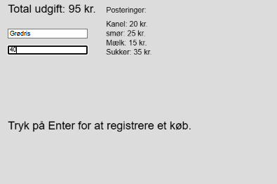

# 2.del. : opgaver i variabler og datatyper - d.8/8-25
## Dagens opgaver, når alle er løst har man "fri" ...

  
Opgave 1 : I can copy I can code dd

  <pre class="white2">
  
    //kopier nedenstående over i p5js editoren
    //og skriv svarende på nedenstående spørgsmål som kommentarer i koden

            function setup() {
                createCanvas(400, 400);
                text("hejsa ",10,10);
                text(20+30,10,40);
                console.log("hejsa længere nede!");
            }

            function draw() {
                background(220);
                text("hejsa igen ",60,10);
                text(50+30,10,48);
                console.log("hejsa længere nede.. mange gange")
            }
 </pre>

<ol>
  <li>Hvad tror du, linjen <code>createCanvas(400, 400);</code> gør? Prøv at ændre tallene til f.eks. <code>createCanvas(600, 200);</code> og se, hvad der sker.</li>
  <li>I <code>setup()</code>-funktionen står der <code>text("hejsa ", 10, 10);</code>. Hvad repræsenterer tallene <code>10</code> og <code>10</code>? Prøv at ændre dem og se, hvor teksten flytter sig hen.</li>
  <li>Der er to forskellige <code>text()</code>-linjer i koden. Hvad er forskellen på <code>text("hejsa ",10,10);</code> og <code>text(20+30,10,40);</code>? Hvad viser den anden linje på skærmen?</li>
  <li>Hvorfor tror du, teksten "hejsa igen" vises på skærmen, men teksten "hejsa" ikke er synlig, når programmet kører?</li>
  <li>Der er to <code>console.log()</code>-linjer. Hvad er forskellen på at bruge <code>console.log()</code> og <code>text()</code>? Hvor kan du se outputtet fra <code>console.log()</code>?</li>
  <li><code>setup()</code> og <code>draw()</code> er to forskellige funktioner. Hvad tror du er den primære forskel på, hvornår de bliver kørt? Kører den ene kun én gang, mens den anden kører gentagne gange?</li>
  <li>Hvad gør linjen <code>background(220);</code> i <code>draw()</code>-funktionen? Hvad sker der, hvis du kommenterer den ud ved at sætte <code>//</code> foran den?</li>
  <li>Prøv at flytte linjen <code>text("hejsa igen ",60,10);</code> fra <code>draw()</code> til <code>setup()</code>-funktionen. Hvad sker der, når du kører koden, og hvorfor?</li>
</ol>

  
Opgave 2 : Datatyper og variabler

  <pre class ="white2">
            //kopier nedenstående over i p5js editoren
            //og skriv svarende på nedenstående spørgsmål som kommentarer i koden

                function setup() {
                createCanvas(600, 400);
                background(200);

                // Variabler med forskellige datatyper
                let navn = "Palle";
                let alder = 28;
                let erStuderende = true;
                let pi = 3.14;
                let hilsen = "Velkommen, " + navn;

                text(hilsen, 10, 30);
                text("Alder: " + alder, 10, 60);
                text("Er studerende? " + erStuderende, 10, 90);
                text("Pi er ca: " + pi, 10, 120);

                console.log("Variablen 'navn' er af typen: " + typeof navn);
                console.log("Variablen 'alder' er af typen: " + typeof alder);
                console.log("Variablen 'erStuderende' er af typen: " + typeof erStuderende);
                }

                function draw() {
                // draw-funktionen er tom i dette eksempel
                }
 

 </pre>

<ol>
  <li>Find de fem **variabler** i koden. Hvilke navne har de, og hvad for en værdi er de hver især blevet tildelt?</li>
  <li>Linjen <code>let navn = "Palle";</code> er et eksempel på en **tekststreng** (String). Hvilke andre variabler i koden er også tekststrenge? Hvordan kan du se det?</li>
  <li>Linjen <code>let alder = 28;</code> er et eksempel på et **tal** (Number). Hvilken anden variabel i koden er også et tal? Hvad er den store forskel på, hvordan tallene er skrevet i forhold til tekststrengene?</li>
  <li>Variablen <code>erStuderende</code> er en **Boolean**. Hvad er det særlige ved denne datatype? Hvilke to mulige værdier kan den have?</li>
  <li>Kig på linjen <code>let hilsen = "Velkommen, " + navn;</code>. Hvad tror du, plus-tegnet <code>+</code> gør i denne sammenhæng? Hvad vil der stå i variablen <code>hilsen</code>?</li>
  <li>Hvad sker der, hvis du ændrer værdien af variablen <code>alder</code> til for eksempel <code>50</code>? Hvilke dele af programmet bliver påvirket af denne ændring?</li>
  <li>I bunden af koden bruges <code>console.log()</code> og <code>typeof</code>. Hvad tror du <code>typeof</code> gør? Hvor kan du finde outputtet fra disse linjer?</li>
  <li>Prøv at ændre variablen <code>pi</code> til at være en tekststreng ved at skrive <code>let pi = "3.14";</code>. Hvad sker der i programmet, og hvilken forskel ser du i konsollen? Hvorfor tror du, det sker?</li>
</ol>

  
Opgave 3 : Lav en regnskabsberegner

   

Her vises programmet som det skal ses ud når det virker. Sådan virker programmet (korrekt)
Input og registrering: Du kan skrive navnet på en vare i det øverste inputfelt og prisen i det nederste.

<ol>
<li>Tastetryk: Når du trykker på Enter-tasten, registreres købet.</li>
<li>Totaludgift: Den indtastede pris lægges til en samlet sum, som vises øverst på skærmen.</li>
<li>Posteringer: Navnet på varen og prisen tilføjes som en ny linje under overskriften "Posteringer". Hver gang du registrerer et nyt køb, vil den nye postering blive vist under den forrige.</li>
<li>På denne måde kan du løbende holde øje med dine udgifter og se en historik over dine køb direkte på skærmen.</li>
</ol>

 brug evt. følgende kode 

   <pre class ="white2">
            //kopier nedenstående over i p5js editoren
            //og skriv svarende på nedenstående spørgsmål som kommentarer i koden

            let vareInput;
            let posteringerTekst = ""; // Vi bruger en tom tekststreng i stedet for et "array"

            function setup() {
                createCanvas(600, 400);
                // Opret input-felter
                vareInput = createInput();
                vareInput.position(20, 65);
            }

            function draw() {
                background(220); // Brug background() til at rydde skærmen
                
                // Tegn den samlede udgift
                textSize(24);
                text('Total udgift: ' + 0 + ' kr.', 20, 30);
                text('Tryk på Enter for at registrere et køb.', 20, 280);

                // Tegn alle posteringerne gemt i tekststrengen
                textSize(16);
                text('Posteringer:', 230, 30);
                text(posteringerTekst, 230, 60); // Viser hele tekststrengen på én gang
            }

            function keyReleased() {
                if (keyCode === ENTER) {
                    let vare = vareInput.value();

                    posteringerTekst = posteringerTekst + vare + "\n";
                    
                    // Rens input-felterne
                    vareInput.value('');
                    
                }
            }
 

 </pre>

