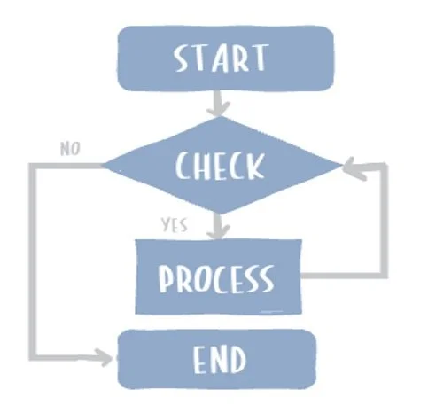
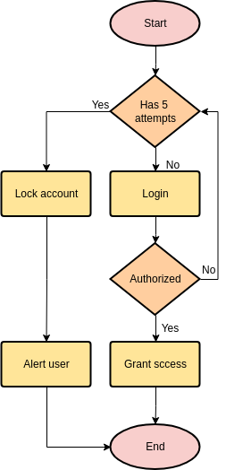
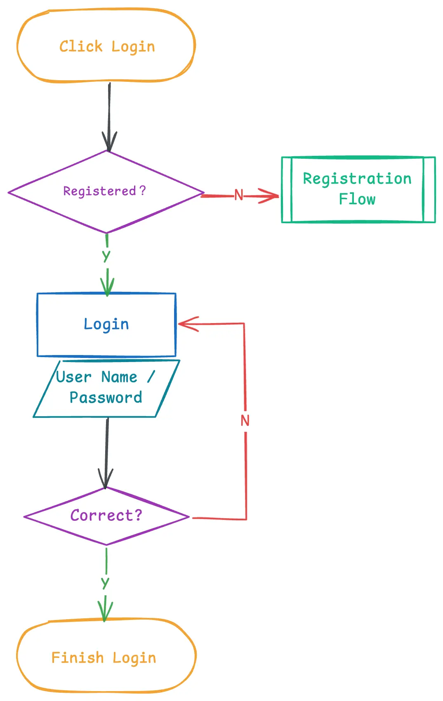

# Nyt Emne : Flowchart Diagram

Når man skal beskrive et programs arbejdsproces, kan man anvende et **flowchart** til at illustrere de forskellige trin.  
Et flowchart er et **modelleringsværktøj**, som giver et visuelt overblik over programmets forløb og viser, hvilke stadier eller beslutninger det gennemgår fra start til slut.

---

## Flowchart Symboler og Betydning

| Symbol | Betydning | Eksempel |
|--------|-----------|-----------|
| ⭕ / afrundet firkant | Start / Slut | Programmet starter eller afsluttes |
| ◆ Diamant | Beslutning / Check | Kontrol af om login-oplysninger er korrekte |
| ▭ Firkant | Proces | Login-processen udføres |
| ⧗ Firkant med skrå kanter | Input | Bruger skriver eller indtaster noget |

Hvert symbol repræsenterer en bestemt type handling eller proces og hjælper os med at forstå, hvad der sker i programmet.

---

## Eksempel: Login Flowchart

Programmet her kontrollerer, om brugeren har opbrugt sine 5 login-forsøg.  
- Hvis alle 5 forsøg er brugt, låser systemet kontoen, informerer brugeren, og programmet afsluttes.  
- Hvis der stadig er forsøg tilbage, går processen videre til login-input og tjekker derefter om koden er korrekt.
    - Er koden korrekt → adgang gives og programmet afsluttes.
    - Er koden forkert → returnerer til login-processen og reducerer antallet af forsøg.

Her ses der også en firkant med skrå kanter, som viser **bruger input**, der er knyttet til login-processen og repræsenterer den handling, brugeren udfører.

---

## Dagens Opgave

Find et program fra hverdagen og lav et **flowchart**, der viser **login-processen**.  
Det kan fx være: **Lectio, Spotify, Steam, Gmail** eller noget helt andet.

Der skal laves:
- Et **flowchart-diagram**, der viser processen
- En **beskrivelse af de forskellige trin og beslutninger**

