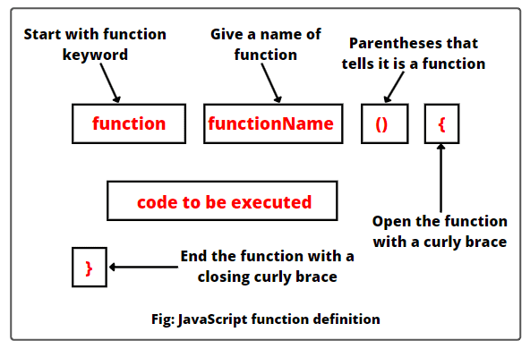

# Del 7 : funktioner - d.5/9-25

[//]: # (-----------------------------------------------------------------------------------------------------------------------------)
[//]: # (--------------------------------------------VIGTIG VIDEN FRA SIDST-----------------------------------------------------------)
[//]: # (-----------------------------------------------------------------------------------------------------------------------------)

  
Vigtig viden fra sidst

- hvad er en array ?"
- hvordan opretter vi en array list `?"
- hvad er en 2D array list ?"
- smarte funktioner til array ?

[//]: # (-----------------------------------------------------------------------------------------------------------------------------)
[//]: # (--------------------------------------------------OPGAVE FRA SIDST-----------------------------------------------------------)
[//]: # (-----------------------------------------------------------------------------------------------------------------------------)

    
Bonus opgave fra sidst

https://editor.p5js.org/msatec/sketches/JD0cur7-Z
 
   

[//]: # (-----------------------------------------------------------------------------------------------------------------------------)
[//]: # (-----------------------------------------------------------------------------------------------------------------------------)
[//]: # (-----------------------------------------------------------------------------------------------------------------------------)
[//]: # (-----------------------------------------------------------------------------------------------------------------------------)
[//]: # (-----------------------------------------------------------------------------------------------------------------------------)
[//]: # (-----------------------------------------------------------------------------------------------------------------------------)
[//]: # (-----------------------------------------------------------------------------------------------------------------------------)
[//]: # (-----------------------------------------------------------------------------------------------------------------------------)
[//]: # (-----------------------------------------------------------------------------------------------------------------------------)
[//]: # (-----------------------------------------------------------------------------------------------------------------------------)

  
Nyt emne : funktioner

[//]: # (-----------------------------------------------------------------------------------------------------------------------------)
[//]: # (--------------------------------------------     F U N K T I O N E R    -----------------------------------------------------------)
[//]: # (-----------------------------------------------------------------------------------------------------------------------------)

[//]: # (-----------------------------------------------------------------------------------------------------------------------------)
[//]: # (-------------------------------------------- Hvad er det          -----------------------------------------------------------)
[//]: # (-----------------------------------------------------------------------------------------------------------------------------)

 

En funktion er en genbrugelig blok af kode, der udfører en bestemt opgave.

Den kan tage input (parametre), fx tal eller tekst.

Den kan give output (returnere noget).

Den gør koden mere overskuelig og nem at bruge flere gange.

[//]: # (-----------------------------------------------------------------------------------------------------------------------------)
[//]: # (-------------------------------------------- funktion scope          -----------------------------------------------------------)
[//]: # (-----------------------------------------------------------------------------------------------------------------------------)

    
funktion scope

scope betyder hvor i koden en variable er tilgængelig for funktionen. 

Der findes en global scope og en lokal scope. 

            function myFunction() {
                let x = 10; // x har lokal scope
                console.log(x); // virker fint her
                    }

                console.log(x); // FEJL! x findes ikke her

Global variable oprettes udenfor funktionen. 

            let y = 5; // global variabel

                function test() {
                 let z = 10; // lokal variabel
                console.log(y); // virker, globale kan tilgås inde i funktion
                console.log(z); // virker
                    }

                        console.log(y); // virker
                        console.log(z); // FEJL! z findes kun inde i funktionen

Hvorfor er scope vigtig ?

Undgår at variabler overskriver hinanden.

Holder koden organiseret og overskuelig.

Gør det muligt at lave genbrugelige funktioner, uden at påvirke resten af koden

  
Dagens opgaver 

  ***opgave 1***
  
  lav en funktion som udskriver hej, både på canvas og console.

  ***opgave 2 – Funktion med parameter***
  
  lav en funktion som tager en lokal variable der hedder navn. 
  og udskriver det på canvas.

  ***opgave 3 global vs lokal***

Lav en global variabel let age = 20;

Lav en funktion birthday() som laver en lokal variabel let age = 21; og skriver den i konsollen.

Efter kald af funktionen, skriv den globale age i konsollen.

Spørgsmål:
Hvilken age bliver vist i funktionen, og hvilken udenfor? 

  ***Bonusopgave lav en circle som skifter farve når man trykker på den** 

 Du skal lave et lille program, hvor en cirkel skifter farve, når man klikker på den.

Opret en cirkel i midten af canvas (circleX, circleY, circleSize).

Start med at give cirklen en farve (fx rød).

Når brugeren klikker inde i cirklen, skal den skifte farve:

Ved første klik → blå

Ved andet klik → rød

Ved tredje klik → blå

osv.

Brug en global variabel clickCount til at holde styr på, hvor mange gange cirklen er blevet klikket.

Lav en funktion changeCircleColor(clickCount) som tager antallet af klik som input og returnerer den rigtige farve (rød eller blå).

Bonus: Udvid opgaven, så cirklen kan få flere farver (fx grøn, gul, lilla) afhængigt af clickCount.

