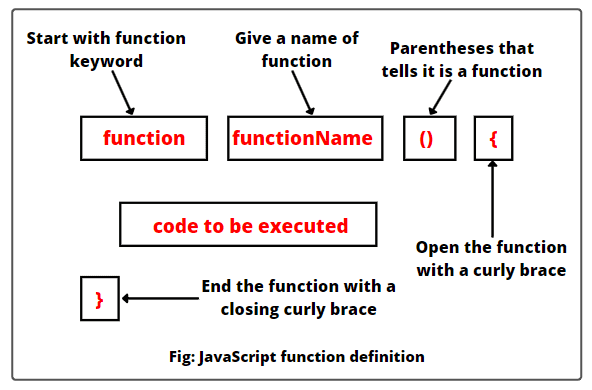

# Del 8 : funktioner - d.25/9-26


[//]: # (-----------------------------------------------------------------------------------------------------------------------------)
[//]: # (--------------------------------------------VIGTIG VIDEN FRA SIDST-----------------------------------------------------------)
[//]: # (-----------------------------------------------------------------------------------------------------------------------------)


<details class="blue">
  <summary>Vigtig viden fra sidst</summary>

- hvad er en array ?"
- hvordan opretter vi en array list `?"
- hvad er en 2D array list ?"
- der er mange smarte funktioner til array, som man bør bruge, slå dem op når nødvendigt  ... [https://developer.mozilla.org/en-US/docs/Web/JavaScript/Reference/Global_Objects/Array](https://developer.mozilla.org/en-US/docs/Web/JavaScript/Reference/Global_Objects/Array)


</details>


[//]: # (-----------------------------------------------------------------------------------------------------------------------------)
[//]: # (--------------------------------------------------OPGAVE FRA SIDST-----------------------------------------------------------)
[//]: # (-----------------------------------------------------------------------------------------------------------------------------)


<details class="blue">
    <summary>Bonus opgave fra sidst</summary>


[https://editor.p5js.org/msatec/sketches/JD0cur7-Z](https://editor.p5js.org/msatec/sketches/JD0cur7-Z)

løsningsforslag

```
let cols = 20;
let rows = 20;
let cellSize = 20;
let snake = [ [10, 9], [10, 10],[10,11],[10,12]]; // Slangens krop som array af [x, y]
let dir = [0, 0]; // Retning: [x, y]
let moveNext = false;

function setup() {
  createCanvas(cols * cellSize, rows * cellSize);
  frameRate(10); // Sætter framerate 
}

function draw() {
  background(220);

  // Hvis vi skal flytte slangen
  if (moveNext) {
    let head = snake[snake.length - 1];
    let newHead = [head[0] + dir[0], head[1] + dir[1]];

    // Tilføj nyt hoved og fjern halen
    snake.push(newHead); // nu det sidste element
    snake.shift(); // fjerner det første

    moveNext = false; // Nulstil, så vi kun bevæger én gang per tast
  }

  // Tegn grid
  stroke(180);
  for (let x = 0; x < cols; x++) {
    for (let y = 0; y < rows; y++) {
      noFill();
      rect(x * cellSize, y * cellSize, cellSize, cellSize);
    }
  }

  // Tegn slangen
  fill(0);
  for (let part of snake) {
    rect(part[0] * cellSize, part[1] * cellSize, cellSize, cellSize);
  }
}

// Skift retning med W/A/S/D
function keyPressed() {
  if (key == 'w') dir = [0, -1];
  if (key == 's') dir = [0, 1];
  if (key == 'a') dir = [-1, 0];
  if (key == 'd') dir = [1, 0]
 

  moveNext = true; // Flyt slangen næste frame
}


```


</details>   


[//]: # (-----------------------------------------------------------------------------------------------------------------------------)
[//]: # (-----------------------------------------------------------------------------------------------------------------------------)
[//]: # (-----------------------------------------------------------------------------------------------------------------------------)
[//]: # (-----------------------------------------------------------------------------------------------------------------------------)
[//]: # (-----------------------------------------------------------------------------------------------------------------------------)
[//]: # (-----------------------------------------------------------------------------------------------------------------------------)
[//]: # (-----------------------------------------------------------------------------------------------------------------------------)
[//]: # (-----------------------------------------------------------------------------------------------------------------------------)
[//]: # (-----------------------------------------------------------------------------------------------------------------------------)
[//]: # (-----------------------------------------------------------------------------------------------------------------------------)


<details class="green">
  <summary>Nyt emne : funktioner</summary>

[//]: # (-----------------------------------------------------------------------------------------------------------------------------)
[//]: # (--------------------------------------------     F U N K T I O N E R    -----------------------------------------------------------)
[//]: # (-----------------------------------------------------------------------------------------------------------------------------)

[//]: # (-----------------------------------------------------------------------------------------------------------------------------)
[//]: # (-------------------------------------------- Hvad er det          -----------------------------------------------------------)
[//]: # (-----------------------------------------------------------------------------------------------------------------------------)


 


En funktion er en genbrugelig blok af kode, der udfører en bestemt opgave.

Den kan tage input (parametre), fx tal eller tekst.

Den kan give output (returnere noget).

Den gør koden mere overskuelig og nem at bruge flere gange.

Husk der må ikke være flere funktioner af samme navn!!

</details>


[//]: # (-----------------------------------------------------------------------------------------------------------------------------)
[//]: # (-------------------------------------------- funktion scope          -----------------------------------------------------------)
[//]: # (-----------------------------------------------------------------------------------------------------------------------------)

<details class= "blue">
    <summary>funktion : scope</summary>

scope betyder hvor i koden en variable er tilgængelig for funktionen. 

Der findes en global scope og en lokal scope. 

            function myFunction() {
                let x = 10; // x har lokal scope
                console.log(x); // virker fint her
                    }

                console.log(x); // FEJL! x findes ikke her


Global variable oprettes udenfor funktionen. 

            let y = 5; // global variabel

                function test() {
                 let z = 10; // lokal variabel
                console.log(y); // virker, globale kan tilgås inde i funktion
                console.log(z); // virker
                    }

                        console.log(y); // virker
                        console.log(z); // FEJL! z findes kun inde i funktionen

Hvorfor er scope vigtig ?

Undgår at variabler overskriver hinanden.

Holder koden organiseret og overskuelig.

Gør det muligt at lave genbrugelige funktioner, uden at påvirke resten af koden

</details>

<details class="blue">
    <summary>funktioner : input</summary>

I nedenstående kode er der to forskellige funktioner der tager hhv. et eller to input. Man kan selv vælge hvor mange input en funktion har:

            function setup(){
              myFunction1(22);
              myFunction2(22,20);  
            }

            function myFunction1(ind) {                 //læg mærke til oprettelsen af en variabel inde i paranteserne - den får input værdien
              let beregning = ind + 20
              console.log(beregning)
            }

            function myFunction2(a,b) {            //læg mærke til der nu er to input variabler, så man kan sende to værdier til funktionen
              let beregning = a + b
              console.log(beregning)
            }


</details>


<details class="blue">
    <summary>funktioner : return</summary>

I javascript og p5js er der mange indbyggede funktioner f.eks. "abs()" der beregner den nummeriske værdi af det tal man giver funktionen som input. Læg mærke til at "abs" ikke gør andet end at erstatte det sted hvor man anvender den med det tal der svarer til den absolutte værdi. Dette fungere ved hjælp af keyworded "return".

F.eks. kunne funktionen "myFunction2" retunere den værdi den før skrev ud på skærmen. Dette kunne anvendes således:

            function setup(){
              
              console.log(myFunction2(22,20));
            }

            function myFunction2(a,b) {
              let beregning = a + b
              return beregning           // dette retunerer værdien til det sted funktion blev kaldt!!!
            }           


</details>


<details class="gray">
  <summary>Dagens opgaver </summary>

***opgave 1***
  
  lav en funktion som udskriver hej, både på canvas og console.

***opgave 2 – Funktion med parameter***
  
  lav en funktion som tager en lokal variable der hedder navn. 
  og udskriver det på canvas.

***opgave 3 global vs lokal***

Lav en global variabel let age = 20;

Lav en funktion birthday() som indeholder en variabel let age = 21; funktionen skal udskrive den lokale age i konsollen.

Efter kald af funktionen, altså i koden udenfor funktionen, skriv den globale age i konsollen.

Spørgsmål:
Hvilken "age" viser funktionen, hvilken "age" vises udenfor og hvorfor? 

***opgave 4 - RGP eventyr-butikken***

Læs hele opgaven inden du begynder at kode noget...

Forestil dig, at du skal lave kodesystemet til en butik i et computerspil. Spilleren vil købe et sværd, men vi skal tjekke prisen, lægge skat/gebyr på, og se om spilleren overhovedet har råd.Her er de 3 funktioner, du skal bygge:

1. beregnPrisMedSkat(basisPris) : Den tager en basispris på en vare og lægger 25% "kongelig skat" oveni. Brug af return: Den skal returnere den nye, samlede pris.

2. harRåd(guldLomme, totalPris) : Den sammenligner, hvor meget guld spilleren har (guldLomme), med hvad varen koster (totalPris). Brug af return: Hvis spilleren har penge nok, skal den returnere true. Hvis ikke, skal den returnere false.

3. købVare(guldLomme, basisPris, vareNavn) :Dette er hovedfunktionen, som kalder de to andre! Hvad den gør: Først kalder den beregnPrisMedSkat for at finde den rigtige pris. Derefter kalder den harRåd (og sender totalprisen med) for at se, om købet kan lade sig gøre. Til sidst retuners en af teksterne "Du har købt [vareNavn]! Du har [guld tilbage] guld tilbage" eller "Gå væk, du har ikke råd til [vareNavn]!"

</details>

<details class="gray">
  <summary>Bonusopgave</summary>

# 🕵️‍♂️ Mission: Det Modulære Spion-System

I denne opgave skal I bygge en krypteringsmaskine ved hjælp af **3 funktioner, der arbejder tæt sammen**. 

Udfordringen er at bygge en lille, smart hjælpefunktion, der kan ændre ét enkelt bogstav ad gangen. Bagefter skal I bruge den funktion inde i jeres hovedfunktioner til at kryptere og dekryptere hele beskeder!

### 💡 Sådan virker "rotation i alfabetet"
Hvis vores `key` er **2**, betyder det, at et bogstav skal skubbes 2 pladser frem i alfabetet:
*   'a' bliver til 'c'
*   'b' bliver til 'd'
*   'z' starter forfra i alfabetet og bliver til 'b'

---

### 📋 De 3 funktioner I skal bygge:

#### 1. `ombyt(bogstav, key)` – Hjælpefunktionen
Denne funktion skal *kun* kunne håndtere **ét enkelt bogstav** ad gangen.
*   **Hvad den gør:** Den finder bogstavets plads i alfabetet, lægger jeres `key` til (f.eks. +2 pladser), og finder det nye bogstav.
*   **Vigtigt:** Hvis man når forbi 'z', skal alfabetet starte forfra!
*   **Brug af return:** Den skal **returnere** det nye, muterede bogstav.

#### 2. `krypter(klartekst, key)`
Denne funktion skal kryptere en hel sætning.
*   **Hvad den gør:** Den skal loope igennem hele din `klartekst` (bogstav for bogstav). For hvert bogstav skal den kalde din hjælpefunktion `ombyt(bogstav, key)` og samle det hele til en ny, hemmelig kode.
*   **Brug af return:** Den **returnerer** den færdige krypterede tekst.

#### 3. `dekrypter(krypteretTekst, key)`
Denne funktion skal rulle koden tilbage, så man kan læse beskeden igen.
*   **Udfordringen:** I stedet for at skrive en helt ny funktion, skal I **genbruge** `krypter`- eller `ombyt`-funktionen! 
*   *Hint:* At dekryptere er det samme som at rotere **baglæns**. Hvordan kan man mon sende en negativ `key` (f.eks. `-2`) med ind i koden?

---

### 🛠️ Hint/Forslag

Det er vigtigt at vide at strings kan behandles som arrays, se nedenfor...

Gem f.eks. alfabetet som en global variabel.

I kan herefter finde et bogstavs placering i alfabetet ved at bruge `alfabet.indexOf(bogstav)`.


```javascript
  let alfabet = "abcdefghijklmnopqrstuvwxyz";
  // det er muligt at behandle en string som om det var et array
  // se nedenfor
  let i = alfabet.indexOf('6')
  print(alfabet[4])
  print(i)
  ```


</details>


