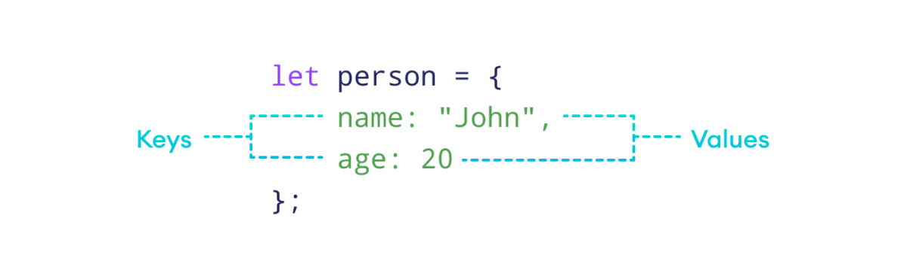

# del 10 : Objektorienteret programmering 1 - Objekter

[//]: # (-----------------------------------------------------------------------------------------------------------------------------)
[//]: # (--------------------------------------------VIGTIG VIDEN FRA SIDST-----------------------------------------------------------)
[//]: # (-----------------------------------------------------------------------------------------------------------------------------)

  
fra sidst : rekursion

En rekursiv funktion er en funktion, der kalder sig selv.
Man skal altid have to ting:

1. Base case → hvornår stopper vi?
2. Recursive step → funktionen kalder sig selv med et "mindre" problem.

[//]: # (-----------------------------------------------------------------------------------------------------------------------------)
[//]: # (--------------------------------------------------NYT EMNE Objekter---------------------------------------------------------)
[//]: # (-----------------------------------------------------------------------------------------------------------------------------)

   

    
Nyt Emne : Objekter
 

    Hvad er et Objekt ?

    I objekt orienteret programmering arbejder ved at organiserer koden omkring objekter istedet for forskellige data og funktioner som ligger rundt.

    Dermed er det nemt for os at genbruge kode, fx når vi bruger arv.

    

    Vi har otte Datatyper i javascript og syv af dem kaldes for Primitive fordi deres værdier kun indholder en ting.

    i modsætning af af fx en en enkelt variable så kan Objekter gemme flere forskellige typer af data.  

 

et objekt oprettes ved at bruge krølle parenteser. 

Et objekt indholder en nøgle og en værdi. Nøglen er navnet på den tilhørende værdi. Her arbejdes med en combination af key:value.

For at få adgang til en ejendom kan vi bruge:

Punktnotationen: 

obj.property.
Notation med firkantede parenteser obj["property"]. Firkantede parenteser tillader at tage nøglen fra en variabel, f.eks obj[varWithKey].

Vi kan også slette en nøgle og dens værdi ved at bruge delete obj.key

for at teste om en nøgle findes så kan vi bruge in operatør. 

        let user = { name: "John", age: 30 };

            alert( "age" in user ); // true, user.age exists
            alert( "blabla" in user ); // false, user.blabla doesn't exist

live kodning med eksempler.

        let Cirkledata = {
             x: 200,
            y: 200,
            d: 200,
            c:null, 
            navn: "cirkle"
        }

        function setup() {
            createCanvas(400, 400);
             Cirkledata.c = random(255);
            Cirkledata.isVisible = true;
            Cirkledata.navn = "yahoo"
            console.log(Cirkledata);
  
        }

        function draw() {
             background(220);
             fill(0)
            text(Cirkledata.navn, 50,50, 50);
             textSize(32);
  
             if (Cirkledata.isVisible) {
            fill(Cirkledata.c, 255, 50, 255)
         }
  
            circle(Cirkledata.x, Cirkledata.y, Cirkledata.d)
        }

    
Dagens opgaver
 

    opgave 1. 

	- opret et tomt objekt kaldes Cirkledata. 

	- tilføj  en key X som har en værdi af 200. 
	
	- tilføj  en key med en string værdi. 

	- Slet X ved at skrive kode i din function setup.
	
	console.log efter hvert trin for at se resultatet.

opgave 2.

	
 byg videre med koden vist her. 

	2.1 

		Lav det så cirklen skifter til en tilfældig farve, når du klikker på canvas.

		Tip: Brug mousePressed() og random(255) til at ændre Cirkledata.c.

	2.2  	

		Tilføj en funktion så når du trykker en tast (f.eks. 'h'), skifter Cirkledata.isVisible mellem true og false.

	2.3   
		Lav et array circles, hvor du kan have flere cirkler. Hver cirkel skal have samme egenskaber som Cirkledata.

		Brug funktionen setup() til at oprette mindst 3 cirkler med forskellige farver, positioner og størrelser.

		Brug en for-loop i draw() til at tegne alle cirklerne.

    
